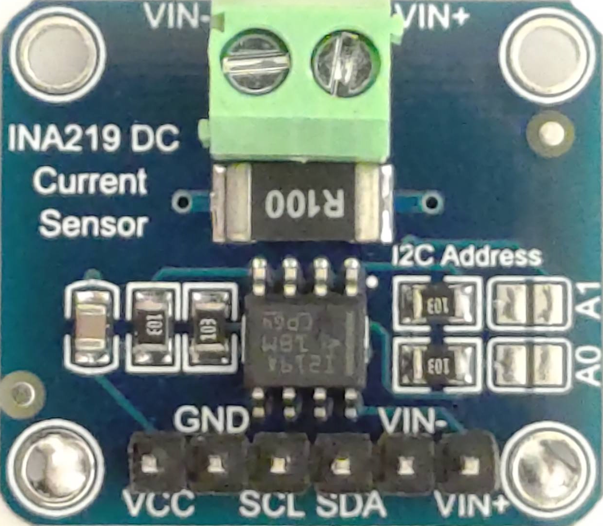
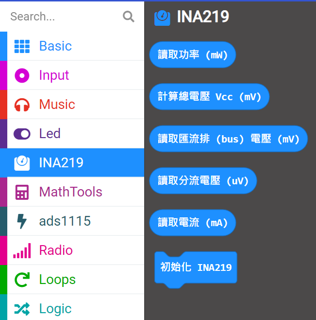

# INA219 Micro:bit Extension


This extension allows you to interface with the INA219 sensor via I2C using the Micro:bit. The INA219 sensor measures voltage, current, and power in your circuits. This extension provides blocks to configure the sensor and read measurements directly from it.

此擴充套件允許您透過 micro:bit 使用 I2C 與 INA219 感測器進行連接。
INA219 感測器可測量電路中的功率、電流及電壓。此擴充套件提供積木以設定感測器並直接讀取測量值。

Since the micro:bit lacks direct capability to measure current and power, 
we rely on the external INA219 module for this task. In the diagram below, 
the upper VIN+ connects to the positive terminal of the voltage to be measured, 
while VIN- connects to the negative terminal. The lower section of the diagram shows VCC, GND, SCL, and SDA, 
which are the I2C signals for communication.

因為 micro:bit 沒有直接量測電流、功率的能力，我們需要用 INA219 這個外接模組來量測。
下圖中，上方的 VIN+ 是接要量測的電壓正極， VIN- 是接要量測電壓的負極。
下圖中，下方的 VCC、GND、SCL、SDA 是 I2C 信號。





## Features

- Read shunt voltage
- Read bus voltage
- Read current
- Calculate power
- Supports configuration and calibration of the INA219 sensor


- 讀取分流電壓  
- 讀取匯流排電壓  
- 讀取電流  
- 計算功率  
- 支援 INA219 感測器的設定與校準  


## Blocks

### Initialize I2C
Initialize I2C communication with the INA219 sensor.
```blocks
ina219.initI2C()
